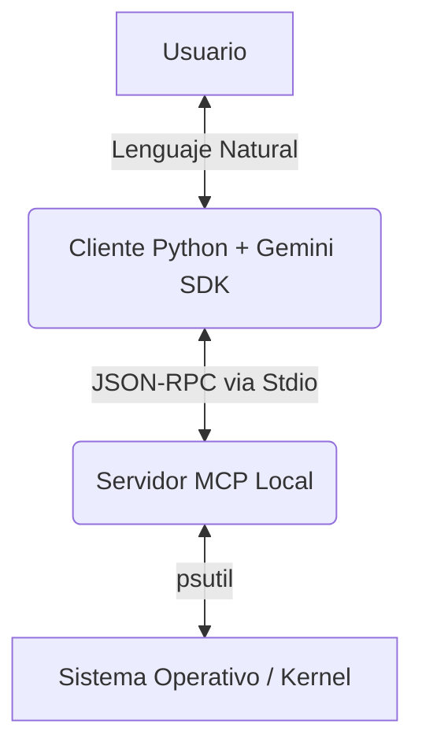

# 🤖 Gemini MCP SysAdmin

Un agente de operaciones de sistema (SysOps) potenciado por IA que utiliza el **Model Context Protocol (MCP)** para permitir que Google Gemini 3 interactúe de forma segura y en tiempo real con el sistema operativo local.


## 💡 ¿Qué es esto?

Este proyecto demuestra la implementación de una arquitectura desagregada de IA donde:

1.  **El Servidor (MCP Host):** Expone herramientas de sistema (lectura de procesos, análisis de red, uso de CPU) de forma segura.
2.  **El Cliente (Gemini):** Razona sobre los problemas del usuario y decide autónomamente qué herramienta ejecutar para diagnosticar el sistema.

A diferencia de un script estático, este agente puede responder preguntas complejas como:

> _"Mi internet va lento, fíjate si hay algún proceso consumiendo ancho de banda o puertos sospechosos abiertos."_

## 🛠️ Capacidades Técnicas

El servidor MCP expone las siguientes herramientas (`Tools`) al LLM:

- `obtener_metricas_sistema`: Monitoreo en tiempo real de CPU y RAM.
- `listar_procesos_top`: Identificación de cuellos de botella por PID.
- `listar_procesos_en_puertos`: Análisis de conexiones TCP/UDP activas (netstat vitaminado).
- `verificar_proceso_en_puerto`: Verificación de disponibilidad de puertos específicos.

## 🚀 Instalación y Uso

1. **Instalacion**

   ```
   git clone https://github.com/Jorge-Marco5/MCP-SysAdmin.git
   cd MCP-SysAdmin
   ```

2. **Activar entorno virtual e Instalar dependencias**

   ```bash
   python3 -m venv .venv
   source .venv/bin/activate
   pip install -r requirements.txt
   ```

3. **Configuracion de variables de entorno**

   ```
   cp .env.example .env
   ```

   - Editar el archivo .env con tu API Key de Google Gemini en [Google AI Studio](https://aistudio.google.com/)

4. **Ejecutar el servidor**

   pruebas del servidor

   ```
   npx @modelcontextprotocol/inspector python server/main.py
   ```

   ejecucion del cliente

   ```
   python client/main.py
   ```

## 🏗️ Arquitectura



## 📚 Tecnologías Utilizadas

**Model Context Protocol (MCP):** SDK de Python (fastmcp).

**Google Generative AI:** Gemini 3 Flash Preview (Function Calling).

**Psutil:** Interacción de bajo nivel con el sistema.

## 👨‍💻 Autor

- [Jorge Marcos](https://github.com/Jorge-Marco5)
